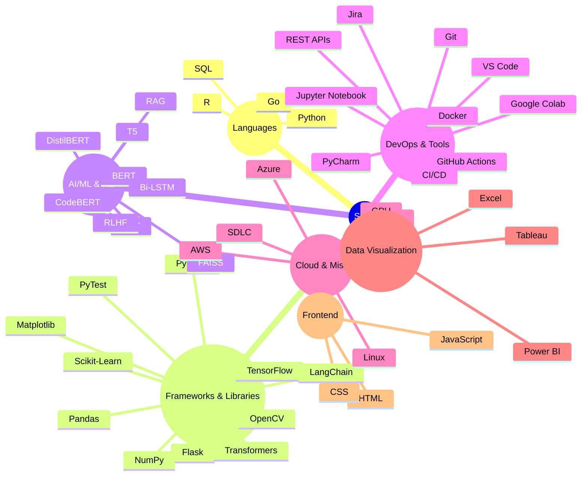

# 👋 Hi, I'm Nithish Ravuvari  
### Software Engineer | AI/ML & GenAI Enthusiast | Creative Problem Solver  

🚀 Software Engineer Intern at **AMD** | Passionate about building **AI-driven solutions**, optimizing **ML workflows**, and automating systems for scalable impact. Skilled in machine learning, NLP, and data science with a knack for solving complex problems.

### ⚡ Tech Snapshot

### 🤝 Connect with Me  
[💼 LinkedIn](https://www.linkedin.com/in/nithishravuvari) &nbsp;|&nbsp; [🧑‍💻 GitHub](https://github.com/nithishravuvari) &nbsp;|&nbsp; 📧 **nitish.ravuvari71@gmail.com**

### 💻 Coding Profiles  
[🏆 LeetCode](https://leetcode.com/u/NithishRavuvari/) &nbsp;|&nbsp; [💡 GeeksforGeeks](https://www.geeksforgeeks.org/user/ravuvari_nithish/) &nbsp;|&nbsp; [👨‍💻 HackerRank](https://www.hackerrank.com/profile/nitish_ravuvari1)

---

Thanks for visiting! ✨ Let’s build something awesome together.

